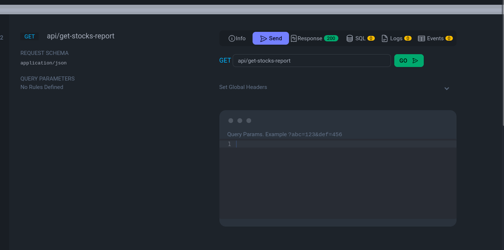

1. cp .env.example .env
2. composer install
3. Run This command:  ./vendor/bin/sail up -d
4. Run Migrations: ./vendor/bin/sail artisan migrate
5. Run Seeder: ./vendor/bin/sail artisan db:seed
6. Run Test Migrations: ./vendor/bin/sail artisan migrate --env=testing
7. Run Test Seeder: ./vendor/bin/sail artisan db:seed --env=testing
8. Run Command to fetch Stock Data: ./vendor/bin/sail artisan app:fetch-stock-prices
9. To run test cases: ./vendor/bin/sail artisan test --filter StockReportControllerTest
10. Go to this URL: http://127.0.0.1/request-docs#GETapi/get-stocks-report
11. Click Go: 
